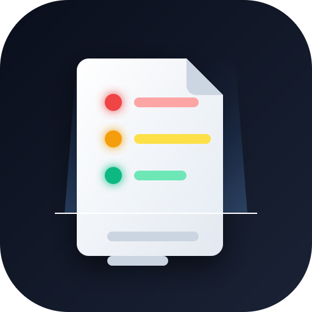

<p align="center">
  
</p>

<h1 align="center">合同红绿灯 🚦</h1>

<p align="center">
  <strong>拍照上传合同，AI 帮你识别风险条款</strong>
</p>

<p align="center">
  
  
  
</p>

---

## 这是什么？

合同红绿灯是一个**合同风险审查工具**。你只需要上传合同（PDF 或图片），系统会自动：

- 📝 识别合同文字
- 🔍 逐条分析风险
- 🚦 用**红黄绿三色**标注风险等级
- 💡 给出通俗易懂的解释和修改建议

**数据全部保存在你的电脑上，不会上传到任何服务器。**

---

## 快速开始

### 环境要求

- **Python 3.10 或更高版本**（推荐 3.11）
- Windows / macOS / Linux 都可以

### 安装步骤

**1. 下载代码**

```bash
git clone https://github.com/tanzhijir-04/clause-light.git
cd clause-light
```

**2. 创建虚拟环境**

```bash
python -m venv venv

# Windows
venv\Scripts\activate

# macOS / Linux
source venv/bin/activate
```

**3. 安装依赖**

```bash
pip install -r requirements.txt
```

**4. 配置 AI 模型**

编辑 `.env` 文件，填入你的 API Key：

```bash
# DeepSeek（推荐，便宜好用）
LLM_DEEPSEEK_API_KEY=你的API密钥
```

> 💡 没有 API Key？可以用本地 Ollama（免费），见下方 [高级配置](#高级配置)

**5. 启动服务**

```bash
python -m server.main
```

**6. 打开浏览器**

访问 http://localhost:8080

---

## 使用方法

1. 点击 **"上传合同"** 按钮
2. 选择合同文件（PDF / JPG / PNG）
3. 等待分析完成（首次会下载 AI 模型，约 2-5 分钟）
4. 查看分析结果：
   - 🔴 红色 = 高风险，需要重点关注
   - 🟡 黄色 = 中风险，建议修改
   - 🟢 绿色 = 安全，可以签署

---

## 功能特性

- ✅ **5 个维度分析**：权责对等、财务风险、知识产权、争议解决、通用风险
- ✅ **知识库**：内置法律知识库，支持自定义规则
- ✅ **原文标注**：在合同原文上高亮风险条款
- ✅ **修改建议**：给出具体的条款修改建议
- ✅ **数据同步**：支持 WebDAV / S3 同步到云端

---

## 高级配置

### 使用本地 Ollama（免费）

如果你不想用付费 API，可以用本地 Ollama：

1. 安装 [Ollama](https://ollama.com/)
2. 下载模型：`ollama pull qwen2.5:7b`
3. 编辑 `data/llm_config.json`：

```json
{
  "local": {
    "enabled": true,
    "models": {
      "classify": "qwen2.5:7b",
      "analyze": "qwen2.5:7b",
      "explain": "qwen2.5:7b"
    }
  }
}
```

### 预下载 Embedding 模型（可选）

首次分析会自动下载知识库模型（约 400MB）。如果你想提前下载：

```bash
python scripts/download_embedding.py
```

---

## 常见问题

**Q: 启动时报错 "No module named 'xxx'"？**
A: 确保已激活虚拟环境，然后重新运行 `pip install -r requirements.txt`

**Q: 分析很慢怎么办？**
A: 首次分析需要下载 AI 模型，后续会很快。也可以用本地 Ollama 加速。

**Q: 支持哪些合同类型？**
A: 租赁、劳动、装修、外包、借款、服务等常见合同类型。

---

## 未来计划

- 📱 **手机端**：React Native PWA，手机也能用
- 🤖 **更多 AI 模型**：支持通义千问、文心一言等
- 📊 **批量分析**：一次上传多个合同
- 🔌 **插件系统**：自定义分析维度
- 🌐 **多语言支持**：英文合同分析

---

## 技术栈

- 后端：Python + FastAPI + SQLAlchemy
- 前端：纯 HTML/CSS/JS（无框架）
- AI：OpenAI 兼容 API / Ollama
- 数据库：SQLite

---

## 许可证

[MIT License](LICENSE) — 自由使用、修改、分发。
