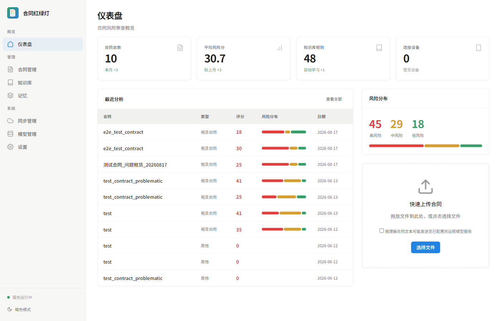

# 基于多阶段 Agent 的合同风险辅助审查系统设计与实现

**English Title:** Design and Implementation of a Contract Risk Auxiliary Review System Based on a Multi-stage Agent Pipeline

**中图分类号：**TP311.52

## 摘要

针对 PDF、扫描图片等非结构化合同材料难以快速定位风险条款的问题，设计并实现合同风险辅助审查系统 ClauseLight。系统采用“文档解析—条款结构化—多维风险分析—冲突复核—结果聚合”的固定阶段流程：先从 PDF、图片或文本文件中提取合同内容，再识别合同类型并拆分条款，随后将条款分配给权责对等、财务风险、知识产权、争议解决和通用风险五个 Worker 并行分析，最后生成风险分布、综合评分、修改建议和人工复核标记。系统后端采用 Python 和 FastAPI 实现，使用 SQLite 保存本地数据，并通过统一模型网关接入远程或本地模型。功能测试、系统运行记录和脱敏租赁合同案例验证了系统流程的可运行性。本文重点讨论系统设计与工程实现，输出仅用于签约前辅助提示。

**关键词：** 合同风险审查；大语言模型；Agent；文档解析；OCR；系统实现

## Abstract

To address the difficulty of locating risky clauses in unstructured contract files, this paper designs and implements ClauseLight, an auxiliary contract risk review system based on a multi-stage Agent pipeline. The system performs document ingestion, clause structuring, parallel risk analysis, conflict review, and result aggregation in fixed stages. Contract clauses are assigned to five Workers that focus on equity, financial, intellectual-property, dispute-resolution, and general risks. The backend is implemented with Python and FastAPI, while SQLite is used for local persistence and a unified model gateway supports remote or local models. Functional tests, local execution records, and desensitized rental-contract cases show that the system can complete contract ingestion, clause-level analysis, result storage, and result presentation. The paper focuses on system design and engineering implementation. The generated results are auxiliary prompts for pre-signing review and do not constitute legal advice.

**Keywords:** contract risk review; large language model; Agent; document parsing; OCR; system implementation

## 1 引言

合同审查涉及付款周期、违约责任、单方解除、责任限制、知识产权和争议解决等内容。现实合同经常以 PDF、扫描图片或复杂办公文档保存，页面布局、扫描质量和条款编号差异会增加文本整理难度。普通用户在签署前需要快速找到需要协商的条款，但逐条阅读耗时较长，直接使用大语言模型进行整份合同问答又容易出现长文本遗漏、风险维度混杂和依据不清等问题。

已有合同推理研究表明，合同分析不仅需要给出整体判断，还应保留与判断相关的证据片段[1-3]。ReAct 研究关注模型推理与外部行动的交替执行[4]，PP-OCR 则为扫描文档的文本获取提供了工程参考[5]。本文围绕三个工程问题展开：不同文件形态下如何形成可追踪的条款对象，多个风险维度并行分析时如何保持结果结构一致，以及模型输出存在冲突或失败时如何保留人工复核入口。为此，本文采用固定的多阶段 Pipeline，将文档解析、条款结构化、风险维度分析和结果聚合分开处理，完成文档入口、五维 Worker、冲突复核、本地存储和前端结果展示等模块，并通过功能测试和脱敏案例验证系统流程。本文的贡献限于可观察的软件流程和工程实现，不将系统输出解释为法律判断准确性。

## 2 需求分析与总体设计

### 2.1 设计目标与约束

系统需要完成文件接入、合同结构解析、多维风险分析、结果展示和异常处理。文字型 PDF 优先使用文本层解析，扫描图片或文本不足时进入 OCR 路径；结构解析阶段输出合同类型、条款编号、标题、正文和风险维度；风险分析阶段输出风险等级、问题说明、修改建议和参考依据；结果页面展示条款原文、综合评分和人工复核标记。合同和分析结果默认保存在本地 SQLite 中。

系统设计遵循三项约束：第一，风险判断必须能够回指到条款原文和结构化字段；第二，模型调用失败、格式错误或知识检索失败时，系统应记录异常并保留可复核状态；第三，数据处理链路应支持本地部署，避免将合同正文作为长期依赖写入外部系统。系统默认本地保存合同；若选择远程模型，上传接口要求用户显式同意合同文本发送给相应服务。上述约束将“模型能否给出答案”转化为“系统能否稳定地产生可检查的中间结果”。[CODE-CONFIG-001]

### 2.2 软件总体架构

系统采用本地优先的客户端—服务端结构，主要由文档入口层、Agent 编排层、风险分析层、知识支撑层、数据存储层和展示层组成。系统不把 Agent 设计成完全自主的决策者，而是使用输入输出相对固定的处理阶段，使错误位置、结构化结果和人工复核入口可被记录。

系统的软件总体架构如图 1 所示。展示与接入层负责 Web 管理面板和移动端代码原型，应用服务层通过 FastAPI、REST API、SSE 上传进度接口和 WebSocket 辅助链路提供接口；移动端原型未计入本轮已验证功能。Agent 编排与领域处理层负责文档入口、ContractAgent、Worker 池和冲突复核，支撑与持久化层提供知识检索、模型调用和 SQLite 数据保存。

图 1 ClauseLight 软件总体架构

*Figure 1 Overall software architecture of ClauseLight*

## 3 多阶段 Agent 流程设计

系统数据流如图 2 所示。

图 2 ClauseLight 多阶段 Agent 流程架构

*Figure 2 Architecture of the ClauseLight multi-stage Agent pipeline*

Stage 1 接收文档入口输出的全文，调用模型识别合同类型并拆分条款。每条条款包含 `id`、`type`、`title`、`text` 和 `relevance` 字段，`relevance` 决定条款进入哪些风险 Worker。Stage 2 根据关联关系组织五个 Worker，并通过异步任务并行执行不同维度的分析。Stage 3 汇总全部 `ClauseRisk` 结果，统计红、黄、绿风险数量，生成综合分数、最高风险条款、处理建议和待复核条款。

各阶段的输入、输出和异常处理见表 1。该表描述的是软件接口约束，不代表模型已经达到某一准确率。

表 1 多阶段 Agent 的阶段接口与异常处理

*Table 1 Stage interfaces and failure handling of the multi-stage Agent pipeline*

| 阶段 | 输入 | 主要处理 | 输出 | 异常处理 |
|---|---|---|---|---|
| 文档入口 | PDF、图片或 TXT | 文本层解析、OCR、页面信息统一 | `DocumentResult` | 重试、切换解析路径或终止并报错 |
| Stage 1 | 全文和页面信息 | 合同类型识别、条款拆分、风险维度路由 | `ClauseItem` 列表 | JSON 解析降级并标记待复核 |
| Stage 2 | 相关 `ClauseItem` | 五个 Worker 异步并行分析 | `ClauseRisk` 列表 | 记录 Worker 异常，不把异常解释为低风险 |
| 复核与 Stage 3 | 多维风险结果 | 冲突检测、二次分析、统计和建议生成 | `AnalysisResult` | 保留冲突标记，模型失败时按已有条款结果回退 |

同一条款可能同时涉及多个风险维度。例如，责任限制条款既可能属于权责对等，也可能属于财务风险。当前实现按 `clause_id` 聚合结果，当同一条款同时出现红色和绿色评级时触发二次分析并保留人工复核标记。黄色差异尚未全部触发二次分析，因此结果仍需人工判断。

系统将模型未完成、解析失败或引用校验失败的结果标记为 `unknown`/待复核，不把失败结果当作绿色；法规依据仅允许引用数据库白名单中的法条 ID 和来源记录。该机制保证了结果可追溯，但不代表法规内容或风险判断已经获得专家金标准验证。

系统使用 `DocumentResult` 保存全文和页面信息，使用 `ClauseItem` 保存结构化条款，使用 `ClauseRisk` 保存风险结果，使用 `AnalysisResult` 保存综合结果。数据库中，`contracts` 保存合同记录，`analyses` 保存分析任务，`clause_analyses` 保存条款级结果，`WorkerRiskResult` 保存多 Worker 轨迹，`knowledge_rules` 和 `legal_references` 保存规则及法规资料。上传接口创建任务后，后端通过 SSE 推送分析进度，结果接口返回综合结果和条款详情；WebSocket 仅用于实际存在的辅助连接链路。

前端仪表盘可以查看合同数量、风险分布、综合评分和最近分析记录，示例界面如图 3 所示。该截图只保留测试合同名称和系统统计信息，不包含合同正文、身份证号、电话或地址。

图 3 ClauseLight 仪表盘界面

*Figure 3 ClauseLight dashboard interface*

## 4 关键模块实现

### 4.1 文档解析与结构化

文档入口通过统一的 `ingest` 接口接收文件。PDF 先尝试本地 AnyDoc 转 Markdown，再检查 PyMuPDF 文本层；文本不足时转入 PaddleOCR，办公文档直接走 AnyDoc，图片走 PaddleOCR。解析结果统一包含全文、页面、文本块和置信度。若解析失败，系统重试或切换路径；仍无法得到有效文本时终止分析并返回错误。

结构解析模块将全文发送给模型，并要求返回合同类型和条款数组。系统对 JSON 字段进行校验，格式错误时进入 JSON 解析或字段补全路径。结构化校验只能保证数据形状，不能保证法律判断正确，因此低置信度和解析失败结果仍需人工复核。

### 4.2 五维风险分析

| Worker | 主要关注内容 | 输出重点 |
|---|---|---|
| 权责对等 | 义务、单方解除、免责和变更权 | 不利方、问题说明、修改建议 |
| 财务风险 | 付款周期、违约金、滞纳金、赔偿上限 | 金额比例、费用负担和协商方向 |
| 知识产权 | 成果归属、保密、竞业和数据使用 | 权利范围和使用限制 |
| 争议解决 | 管辖、仲裁、诉讼成本和举证责任 | 争议处理风险和复核提示 |
| 通用风险 | 不可抗力、转让、通知和其他条款 | 条款缺失、表述不清和一般风险 |

各 Worker 使用统一字段输出 `risk_level`、`risk_type`、`issue`、`unfavorable_to`、`severity`、`suggestion` 和 `legal_basis`。统一字段便于合并结果，也使前端能够按条款展示问题、依据和修改建议。知识库提供规则和法规资料作为参考，不直接替代专业人员制定的审查标准。

### 4.3 结果聚合与异常处理

聚合模块优先使用模型返回的综合分数和风险分布；当模型没有返回有效分布时，系统根据条款结果统计红、黄、绿数量；当没有评分时，按绿色 90、黄色 60、红色 20 的经验权重计算回退分数。该公式属于系统经验规则，不是经过法律专家校准的评分标准。

LLM 调用通过统一网关完成，网关负责模型配置、结构化响应、重试和 JSON 降级。知识库检索失败时可以跳过知识增强并继续分析。当前实现中，单个 Worker 失败仍存在使用绿色占位结果的风险，论文将其作为系统局限，不能把该类结果解释为低风险。

## 5 系统测试与案例分析

### 5.1 测试环境与功能测试

系统测试环境见表 2。

表 2 测试环境

*Table 2 Test environment*

| 项目 | 配置 |
|---|---|
| 操作系统与 CPU | Windows 11；AMD Ryzen 7 5700X3D，8 核 8 线程 |
| 软件环境 | Python 3.12.5；FastAPI 0.110.2；SQLAlchemy 2.0.49 |
| 文档处理 | PyMuPDF 1.27.2.3；PaddleOCR 3.7.0；PaddlePaddle 3.3.1 |
| 测试版本 | Git 提交号 `769e9b43`；pytest 9.0.3 |

测试覆盖文件上传、PDF 解析、OCR、条款结构化、五维分析、冲突标记、结果保存、API 查询、SSE 上传进度和 WebSocket 辅助接口。当前全量测试结果为 313 个通过、2 个跳过、8 个警告；跳过项来自可选依赖。上述结果说明模块和接口能够运行，不等于合同风险识别准确率。[TEST-BASELINE-001][TEST-E2E-001]

测试证据由组件测试、API 测试和端到端页面测试组成，分别对应 `tests/test_document_ingress.py`、`tests/test_agent.py`、`tests/test_api_*.py` 以及 `tests/e2e_quick.py`、`tests/e2e_full.py`。论文保留测试命令、代码版本和运行环境，是为了使读者能够复现“流程可运行”这一结论，而不是将通过率替代为风险识别效果指标。

### 5.2 本地运行记录

对 SQLite 数据库进行只读统计得到：`contracts` 10 条、`analyses` 7 条、`clause_analyses` 92 条、`knowledge_rules` 48 条、`legal_references` 43 条。7 条分析记录的综合分数为 18、25、25、30、35、41 和 41，条款级结果中红色 45 条、黄色 29 条、绿色 18 条。这些记录可能包含重复文件或同一合同的多次分析，不作为独立合同数据集，也不用于计算准确率、召回率或稳定性指标。[TEST-SCREENSHOT-001]

为避免把运行日志误读为实验样本，本文将数据库统计用于说明持久化链路已产生记录，将脱敏案例用于说明输入、条款和输出之间的对应关系，将自动化测试用于说明模块接口行为，三类证据不合并计算模型性能。若要报告准确率、召回率或专家一致性，还需要建立独立的标注数据集和预先确定的评价协议。

路线 B 已实现单次整文、串行多阶段和并行多阶段的实验记录与预检工具，但当前没有满足六个独立组、授权和模型价格快照条件的私有运行数据，因此本文不填入正式对照实验数值。

### 5.3 脱敏案例

案例 A 为两页租赁合同 PDF，文字层约 1425 个字符，系统保存的综合分数为 35，建议协商后再签。系统重点提示押金扣除条件宽泛、逾期付款或占用费负担较重、出租方单方解除条件较宽等问题，并将维修责任、通知方式和费用承担列为黄色风险。

案例 B 为另一份两页租赁合同 PDF，文字层约 1550 个字符；案例 C 是与案例 B 内容相近的 TXT 输入，约 1594 个字符。相关运行记录中的分数分布在 18—30 之间，系统识别出押金返还、单方收回、维修责任、免责条款和争议解决等关注点。PDF 与 TXT 的换行和标点差异可能影响条款边界，因此前端保留原文查看和条款映射，供用户核对。

表 3 脱敏案例及系统输出

*Table 3 Desensitized cases and system outputs*

| 案例 | 输入形式 | 主要条款 | 系统输出 | 用途边界 |
|---|---|---|---|---|
| A | PDF，2 页 | 押金、逾期、维修、解除、争议 | 综合分数 35，建议协商后再签 | 展示条款风险定位 |
| B | PDF，2 页 | 租金、押金、免责、管辖 | 多次运行分数 18—30 | 展示多维分析流程 |
| C | TXT | 与案例 B 相近 | 用于比较输入路径差异 | 不计为独立合同 |

## 6 讨论

ClauseLight 的工程特点有三点：一是把文档解析、条款结构化、风险分析和结果聚合拆成可记录阶段；二是将风险任务分配给不同 Worker，降低单次分析的任务混杂；三是保存条款原文、问题说明、修改建议和人工复核标记，方便用户回到原文核对。

系统仍受模型版本、提示词、上下文长度和 OCR 质量影响。风险等级和综合分数没有经过法律背景人员标注，知识库内容也需要专业人员核验。当前样本主要为租赁合同，不能推断其他合同类型的效果；Worker 失败状态、黄色风险冲突和模型兼容性仍需改进。现有证据支持的是系统流程和接口行为，不支持与其他模型进行性能优劣比较。系统不能替代律师或作为单独的签约、诉讼依据。

## 7 结论

本文设计并实现了 ClauseLight 合同风险辅助审查系统，将非结构化文件解析、条款结构化、五维风险分析、冲突复核和结果聚合组织为固定的多阶段 Pipeline。功能测试、数据库运行记录和脱敏案例表明，系统能够完成合同接入、条款级分析、结果保存和前端展示。本文结论限于系统工程可行性，不延伸为风险识别准确率或法律判断准确性的结论。

## 参考文献

[1] Koreeda Y., Manning C. D. ContractNLI: A Dataset for Document-level Natural Language Inference for Contracts[C]//Findings of the Association for Computational Linguistics: EMNLP 2021. 2021: 1907-1919.

[2] Chalkidis I., Jana A., Hartung D., et al. LexGLUE: A Benchmark Dataset for Legal Language Understanding in English[C]//Proceedings of the 60th Annual Meeting of the Association for Computational Linguistics. 2022: 4310-4330.

[3] Mathur P., Kunapuli G., Bhat R., et al. DocInfer: Document-level Natural Language Inference using Optimal Evidence Selection[C]//Proceedings of the 2022 Conference on Empirical Methods in Natural Language Processing. 2022: 809-824.

[4] Yao S., Zhao J., Yu D., et al. ReAct: Synergizing Reasoning and Acting in Language Models[EB/OL]. 2023.

[5] Du Y., Li C., Guo R., et al. PP-OCR: A Practical Ultra Lightweight OCR System[EB/OL]. 2020.
